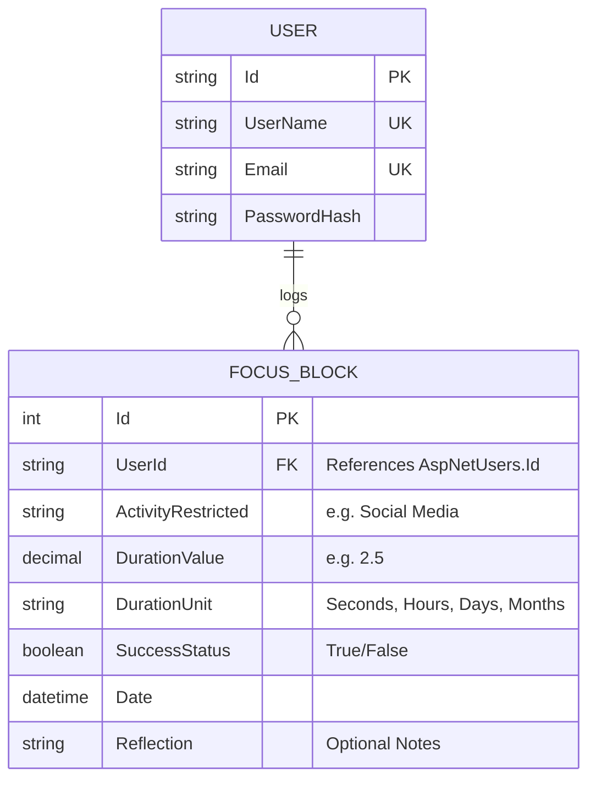
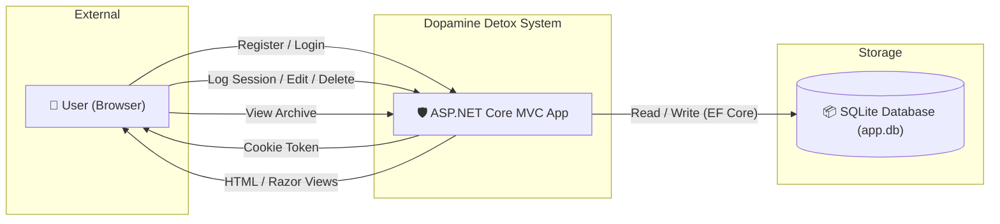
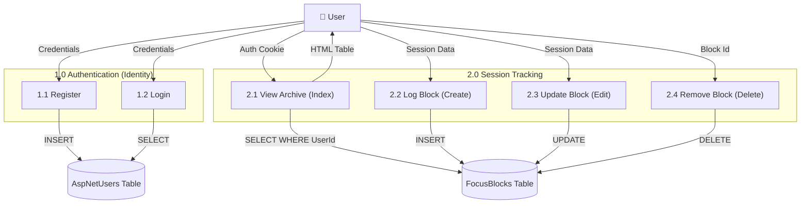
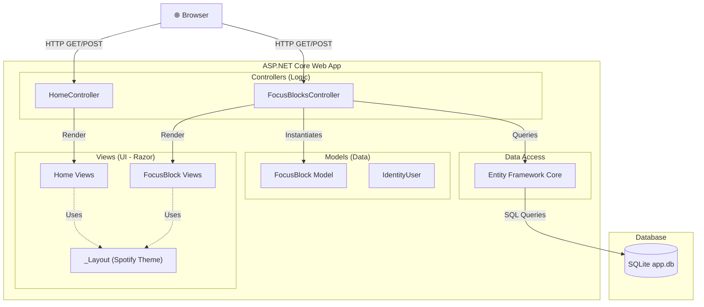

<p align="center">
  
  
  
  
</p>

# 🧠 Dopamine Detox Ledger

> **Dopamine Detox Ledger** is a focused, full-stack ASP.NET Core MVC web application designed to track deep-work sessions and behavioral restriction protocols (e.g., social media fasts). Built strictly as a minimal MVC CRUD application, the system emphasizes extreme utility. It employs a modern **Spotify-inspired dark theme**—utilizing rich dark grays, vibrant green accents, and legible typography—to provide a distraction-free, premium user experience.

---

## 📑 Table of Contents

- [Technology Stack](#-technology-stack)
- [Project Structure](#-project-structure)
- [Entity-Relationship Diagram (ERD)](#-entity-relationship-diagram-erd)
- [Data Flow Diagrams (DFD)](#-data-flow-diagrams-dfd)
- [System Architecture](#-system-architecture)
- [Database Schema](#-database-schema)
- [Route Documentation](#-route-documentation)
- [Frontend Pages](#-frontend-pages)
- [Getting Started](#-getting-started)
- [License](#-license)

---

## 🛠 Technology Stack

| Layer      | Technology                                     |
|------------|-------------------------------------------------|
| Frontend   | HTML5, Razor Views (`.cshtml`), Vanilla CSS     |
| Theme      | Spotify-inspired Dark Mode (Inter font, `#1db954` accent) |
| Backend    | C# 12, ASP.NET Core MVC (.NET 10.0)             |
| Database   | SQLite 3 (Embedded local file `app.db`)         |
| ORM        | Entity Framework Core (Code-First)              |
| Auth       | ASP.NET Core Identity (Cookie-based Auth)       |

---

## 📁 Project Structure

```text
detox/
├── Controllers/
│   ├── FocusBlocksController.cs    # CRUD Operations & User Isolation
│   └── HomeController.cs           # Landing page logic
├── Data/
│   └── ApplicationDbContext.cs     # EF Core Context & DbSet
├── Models/
│   ├── FocusBlock.cs               # Core data entity (Annotations & Validation)
│   └── ErrorViewModel.cs           # Error handling model
├── Views/
│   ├── FocusBlocks/
│   │   ├── Create.cshtml           # "The Terminal" Create Form
│   │   ├── Edit.cshtml             # "The Terminal" Edit Form
│   │   └── Index.cshtml            # "The Archive" Data Table
│   ├── Home/
│   │   └── Index.cshtml            # Hero / Landing Page
│   └── Shared/
│       ├── _Layout.cshtml          # Global HTML wrapper (No Bootstrap)
│       └── _LoginPartial.cshtml    # Auth navigation links
├── wwwroot/
│   └── css/
│       └── site.css                # Global CSS variables & styling rules
├── Program.cs                      # Dependency Injection, Middleware, Auth config
├── appsettings.json                # SQLite connection string
└── app.db                          # Generated SQLite database
```

---

## 🗃 Entity-Relationship Diagram (ERD)

The application uses ASP.NET Core Identity linked to our custom `FocusBlock` model:

- A **User** (from `AspNetUsers`) can log many **FocusBlocks** (one-to-many).
- A **FocusBlock** belongs to exactly one **User**.
- Entity Framework Core enforces strict foreign key constraints and user-level data isolation.



---

## 📊 Data Flow Diagrams (DFD)

### Level 0 — Context Diagram

Shows the system interacting with the user and the local database.



### Level 1 — Process Decomposition

Breaks down the system into core subsystems showing data flows.



---

## 🏗 System Architecture

The application strictly adheres to the **Model-View-Controller (MVC)** architectural pattern.



---

## 🗃 Database Schema

| Table | Column | Type | Constraints | Description |
|-------|--------|------|-------------|-------------|
| `AspNetUsers` | `Id` | `TEXT` | PK | Unique Identity ID |
| | `Email` | `TEXT` | UNIQUE | User Email Address |
| | `PasswordHash` | `TEXT` | | Bcrypt password hash |
| `FocusBlocks` | `Id` | `INTEGER` | PK, Auto-Increment | Unique block ID |
| | `UserId` | `TEXT` | FK | Links to `AspNetUsers.Id` |
| | `ActivityRestricted` | `TEXT` | Required | Name of the restricted habit |
| | `DurationValue` | `DECIMAL` | Required, `> 0` | Numerical magnitude of time |
| | `DurationUnit` | `TEXT` | Required | `Seconds`, `Hours`, `Days`, `Months` |
| | `SuccessStatus` | `INTEGER` | Required (Boolean) | `1` = Success, `0` = Failure |
| | `Date` | `TEXT` | Required (Date) | Date the block occurred |
| | `Reflection` | `TEXT` | MaxLength 500 | Optional post-session notes |

---

## 📡 Route Documentation

Since this is an MVC application returning HTML (not a JSON API), the routing system follows standard ASP.NET Core controller patterns.

### Authentication Routes (Identity Area)

| Method | Endpoint | Description |
|--------|----------|-------------|
| GET/POST | `/Identity/Account/Register` | Render and submit the user registration form |
| GET/POST | `/Identity/Account/Login` | Render and submit the user login form |
| POST | `/Identity/Account/Logout` | Clear auth cookie and redirect to Home |

### Application Routes (FocusBlocksController)

*All `FocusBlocks` routes are protected by the `[Authorize]` attribute.*

| Method | Endpoint | Description | View Rendered |
|--------|----------|-------------|---------------|
| GET | `/` | Public Landing/Hero Page | `Home/Index.cshtml` |
| GET | `/FocusBlocks` | List all blocks for the current user | `FocusBlocks/Index.cshtml` |
| GET | `/FocusBlocks/Create` | Show the "Log New Block" form | `FocusBlocks/Create.cshtml` |
| POST | `/FocusBlocks/Create` | Validate and insert new block into DB | — (Redirects to Index) |
| GET | `/FocusBlocks/Edit/{id}` | Show the "Edit Block" form | `FocusBlocks/Edit.cshtml` |
| POST | `/FocusBlocks/Edit/{id}` | Validate and update existing block | — (Redirects to Index) |
| GET | `/FocusBlocks/Delete/{id}` | Show delete confirmation screen | `FocusBlocks/Delete.cshtml` |
| POST | `/FocusBlocks/Delete/{id}` | Execute delete from DB | — (Redirects to Index) |

---

## 🖥 Frontend Pages

The application utilizes Razor Views styled completely from scratch using vanilla CSS, abandoning Bootstrap to enforce a strict, premium aesthetic.

1. **Home / Hero Page**: Features a massive typographic header, dynamic stat cards, and clear Call-To-Action buttons to enter the app.
2. **The Archive (Dashboard)**: A sleek data table displaying logs with dynamic color-coded badges for activity types and success/failure statuses.
3. **The Terminal (Forms)**: Form inputs styled as floating dark-mode elements. Includes dynamic layout using CSS Flexbox/Grid for duration value and unit pairing.

---

## 🚀 Getting Started

### Prerequisites

- **.NET 10.0 SDK** installed on your machine.
- **Git** for version control.

### Run Locally

1. **Clone the repository:**
   ```bash
   git clone <your-repository-url>
   cd detox
   ```

2. **Restore NuGet dependencies:**
   ```bash
   dotnet restore
   ```

3. **Apply Database Migrations:**
   *This will automatically generate the `app.db` SQLite database file.*
   ```bash
   dotnet ef database update
   ```

4. **Run the Application:**
   ```bash
   dotnet run --urls "http://localhost:5000"
   ```

5. **Access the App:**
   Open your browser and navigate to `http://localhost:5000`. Click "Register" to create an account and begin logging your focus blocks!

---

## 📄 License

© 2026 Dopamine Detox Ledger — Abdelrahman Ashraf — Assiut University. 
Developed for academic purposes as part of a university software engineering course.

---

<p align="center">
  <strong>Built with focus 🎯</strong>
</p>
